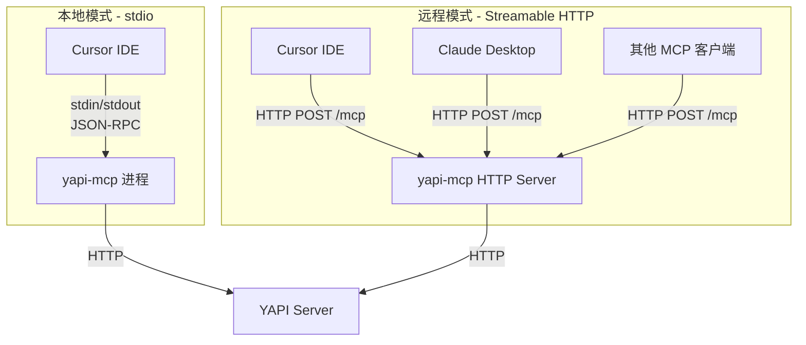

# YAPI MCP Server 完整方案（Go + mcp-go）

## 一、技术选型

### 语言与框架：Go + mcp-go

- **语言**: Go（编译为单一二进制，分发简单，跨平台；性能优于 Node.js）
- **MCP SDK**: [mcp-go](https://github.com/mark3labs/mcp-go)（Go 最成熟的 MCP 实现，8.4k Star，支持完整 MCP 规范）
- **Go 版本**: >= 1.23.0（mcp-go 要求）

### 传输方式：双模式（stdio + Streamable HTTP）

同时支持两种传输模式，通过命令行参数切换：

- **stdio 模式**（本地）：适合个人开发者在 Cursor / Claude Desktop 中使用，服务以子进程运行
- **Streamable HTTP 模式**（远程服务）：适合团队共享，部署为 HTTP 服务，支持多客户端连接




### 技术栈总结

- 语言: Go 1.23+
- MCP SDK: `github.com/mark3labs/mcp-go`
- 配置: YAML 配置文件 + `gopkg.in/yaml.v3`
- HTTP 客户端: Go 标准库 `net/http`
- 命令行: Go 标准库 `flag`
- 日志: Go 标准库 `log`

---

## 二、项目结构

```
yapi-mcp/
├── go.mod
├── go.sum
├── .gitignore
├── README.md                        # 完整教学文档
├── config.example.yaml              # 配置示例
├── Makefile                         # 构建命令
│
├── cmd/
│   └── yapi-mcp/
│       └── main.go                  # 入口：解析参数，选择传输模式
│
└── internal/
    ├── config/
    │   └── config.go                # 配置加载与校验（YAML + 环境变量）
    │
    ├── yapi/
    │   ├── client.go                # YAPI HTTP 客户端封装
    │   └── types.go                 # YAPI API 响应类型定义
    │
    ├── cache/
    │   └── cache.go                 # 内存 TTL 缓存（项目信息 + 分类列表）
    │
    ├── server/
    │   └── server.go                # MCP Server 构建：注册 tools/resources/prompts/hooks
    │
    ├── tools/
    │   ├── list_projects.go         # Tool: 列出已配置项目
    │   ├── get_project_info.go      # Tool: 获取项目详情
    │   ├── get_categories.go        # Tool: 获取接口分类
    │   ├── list_interfaces.go       # Tool: 获取接口列表
    │   ├── get_interface_detail.go  # Tool: 获取接口详情
    │   ├── search_interfaces.go     # Tool: 搜索接口
    │   └── save_interface.go        # Tool: 新增/更新接口
    │
    ├── resources/
    │   └── resources.go             # Resources: 项目列表 + 接口文档资源
    │
    ├── prompts/
    │   └── prompts.go               # Prompts: API 设计审查等提示模板
    │
    └── middleware/
        └── middleware.go            # Hooks + Middleware: 日志、耗时、恢复
```

---

## 三、多项目配置方案

### 配置文件 `config.yaml`

参考 lzsheng/Yapi-MCP 的 `projectId:token` 模式，但采用更清晰的 YAML 结构：

```yaml
yapi_base_url: "https://yapi.example.com"

cache_ttl_minutes: 10

log_level: "info"   # debug / info / warn / error

projects:
  - project_id: 1026
    token: "your-token-for-project-1026"
    name: "用户服务"
    description: "用户相关的 API 接口"

  - project_id: 1027
    token: "your-token-for-project-1027"
    name: "订单服务"
    description: "订单相关的 API 接口"

  - project_id: 1028
    token: "your-token-for-project-1028"
    name: "支付服务"
    description: "支付相关的 API 接口"
    base_url: "https://another-yapi.example.com"  # 可选：覆盖全局 base_url
```

### 配置加载优先级

1. 命令行参数 `-config /path/to/config.yaml`
2. 环境变量 `YAPI_MCP_CONFIG`（指向配置文件路径）
3. 当前工作目录下的 `yapi-mcp.config.yaml`

### 环境变量覆盖（可选）

部分敏感配置可通过环境变量覆盖（优先级最高）：

- `YAPI_BASE_URL` — 覆盖全局 base_url
- `YAPI_LOG_LEVEL` — 覆盖日志级别

---

## 四、MCP 工具设计（7 个工具）

参考 lzsheng/Yapi-MCP 的功能设计，保留核心的 5 个只读工具 + 搜索 + 写入：

### 4.1 `yapi_list_projects` — 列出所有已配置项目

```go
mcp.NewTool("yapi_list_projects",
    mcp.WithDescription("列出所有已配置的 YAPI 项目及其基本信息"),
)
```

- 输入：无参数
- 输出：项目 ID、名称、描述列表
- 用途：LLM 先调用此工具了解有哪些项目可用

### 4.2 `yapi_get_project_info` — 获取项目详情

```go
mcp.NewTool("yapi_get_project_info",
    mcp.WithDescription("获取 YAPI 项目的详细信息"),
    mcp.WithString("project_id", mcp.Required(), mcp.Description("项目 ID")),
)
```

- YAPI API: `GET /api/project/get`

### 4.3 `yapi_get_categories` — 获取接口分类列表 + 分类下接口

```go
mcp.NewTool("yapi_get_categories",
    mcp.WithDescription("获取项目下的接口分类列表，每个分类包含其下的接口列表"),
    mcp.WithString("project_id", mcp.Required(), mcp.Description("项目 ID")),
)
```

- YAPI API: `GET /api/interface/list_menu`
- 参考 lzsheng/Yapi-MCP 的 `yapi_get_categories`，返回分类 + 每个分类下的接口摘要

### 4.4 `yapi_list_interfaces` — 获取接口列表（分页）

```go
mcp.NewTool("yapi_list_interfaces",
    mcp.WithDescription("获取指定分类下的接口列表，支持分页"),
    mcp.WithString("project_id", mcp.Required(), mcp.Description("项目 ID")),
    mcp.WithString("cat_id", mcp.Description("分类 ID，不填则返回全部")),
    mcp.WithNumber("page", mcp.Description("页码，默认 1")),
    mcp.WithNumber("limit", mcp.Description("每页数量，默认 20")),
)
```

- YAPI API: `GET /api/interface/list` 或 `GET /api/interface/list_cat`

### 4.5 `yapi_get_interface_detail` — 获取接口详情

```go
mcp.NewTool("yapi_get_interface_detail",
    mcp.WithDescription("获取接口的完整详细信息，包括请求参数、请求体、响应体等"),
    mcp.WithString("project_id", mcp.Required(), mcp.Description("项目 ID")),
    mcp.WithString("interface_id", mcp.Required(), mcp.Description("接口 ID")),
)
```

- YAPI API: `GET /api/interface/get`
- 输出格式化为结构清晰的 JSON/Markdown，包含：基本信息、请求参数、请求头、请求体（表单/JSON）、响应体

### 4.6 `yapi_search_interfaces` — 搜索接口

```go
mcp.NewTool("yapi_search_interfaces",
    mcp.WithDescription("按关键词搜索接口，支持按名称和路径匹配"),
    mcp.WithString("keyword", mcp.Required(), mcp.Description("搜索关键词")),
    mcp.WithString("project_id", mcp.Description("限定项目 ID，不填则搜索所有项目")),
    mcp.WithNumber("limit", mcp.Description("返回数量限制，默认 20")),
)
```

- 实现：调用 `list_menu` 获取全量数据后本地过滤（按 title、path 模糊匹配）
- 参考 lzsheng/Yapi-MCP 的多关键词组合搜索逻辑

### 4.7 `yapi_save_interface` — 新增/更新接口

```go
mcp.NewTool("yapi_save_interface",
    mcp.WithDescription("新增或更新 YAPI 接口，提供 id 则更新，不提供则新增"),
    mcp.WithString("project_id", mcp.Required(), mcp.Description("项目 ID")),
    mcp.WithString("cat_id", mcp.Required(), mcp.Description("分类 ID")),
    mcp.WithString("title", mcp.Required(), mcp.Description("接口标题")),
    mcp.WithString("path", mcp.Required(), mcp.Description("接口路径")),
    mcp.WithString("method", mcp.Required(), mcp.Description("请求方法"),
        mcp.Enum("GET", "POST", "PUT", "DELETE", "PATCH")),
    mcp.WithString("id", mcp.Description("接口 ID，有则更新，无则新增")),
    // ... 更多可选参数
)
```

- YAPI API: `POST /api/interface/add` 或 `POST /api/interface/up`
- 工具注解标记为**非只读、破坏性操作**

---

## 五、MCP Resources（资源）— 教学展示

通过 Resources 展示 MCP 的只读数据暴露能力：

### 5.1 静态资源：项目列表

```go
mcp.NewResource("yapi://projects", "YAPI 项目列表",
    mcp.WithResourceDescription("所有已配置的 YAPI 项目"),
    mcp.WithMIMEType("application/json"),
)
```

### 5.2 动态资源（URI 模板）：接口文档

```go
mcp.NewResourceTemplate("yapi://projects/{projectId}/interfaces/{interfaceId}",
    "接口文档",
    mcp.WithTemplateDescription("获取指定接口的完整文档"),
    mcp.WithTemplateMIMEType("application/json"),
)
```

---

## 六、MCP Prompts（提示模板）— 教学展示

### 6.1 API 设计审查提示

```go
mcp.NewPrompt("api_design_review",
    mcp.WithPromptDescription("审查 API 接口设计是否符合 RESTful 规范"),
    mcp.WithArgument("project_id", mcp.RequiredArgument(),
        mcp.ArgumentDescription("项目 ID")),
    mcp.WithArgument("interface_id", mcp.RequiredArgument(),
        mcp.ArgumentDescription("接口 ID")),
)
```

### 6.2 接口文档生成提示

```go
mcp.NewPrompt("generate_api_docs",
    mcp.WithPromptDescription("根据接口定义生成开发者友好的 API 文档"),
    mcp.WithArgument("project_id", mcp.RequiredArgument(),
        mcp.ArgumentDescription("项目 ID")),
)
```

---

## 七、Hooks 与 Middleware — 教学展示

### 7.1 请求生命周期钩子

```go
hooks := &server.Hooks{}

// 所有请求的日志记录
hooks.AddBeforeAny(func(ctx context.Context, id any, method mcp.MCPMethod, msg any) {
    log.Printf("[MCP] --> %s", method)
})
hooks.AddOnSuccess(func(ctx context.Context, id any, method mcp.MCPMethod, msg any, result any) {
    log.Printf("[MCP] <-- %s OK", method)
})
hooks.AddOnError(func(ctx context.Context, id any, method mcp.MCPMethod, msg any, err error) {
    log.Printf("[MCP] <-- %s ERROR: %v", method, err)
})

// 客户端初始化钩子
hooks.AddBeforeInitialize(func(ctx context.Context, id any, msg *mcp.InitializeRequest) {
    log.Printf("[MCP] 客户端连接: %s %s", msg.Params.ClientInfo.Name, msg.Params.ClientInfo.Version)
})
```

### 7.2 工具调用中间件

```go
// 耗时统计中间件
server.WithToolHandlerMiddleware(func(next server.ToolHandlerFunc) server.ToolHandlerFunc {
    return func(ctx context.Context, req mcp.CallToolRequest) (*mcp.CallToolResult, error) {
        start := time.Now()
        result, err := next(ctx, req)
        log.Printf("[Tool] %s 耗时 %v", req.Params.Name, time.Since(start))
        return result, err
    }
})

// panic 恢复
server.WithRecovery()
```

---

## 八、入口与传输切换

`[cmd/yapi-mcp/main.go](cmd/yapi-mcp/main.go)` 核心逻辑：

```go
func main() {
    var (
        transport  string
        configPath string
        port       string
    )
    flag.StringVar(&transport, "transport", "stdio", "传输模式: stdio 或 http")
    flag.StringVar(&configPath, "config", "", "配置文件路径")
    flag.StringVar(&port, "port", "8080", "HTTP 模式端口")
    flag.Parse()

    cfg := config.Load(configPath)
    mcpServer := server.NewYapiMCPServer(cfg)

    switch transport {
    case "http":
        httpServer := server.NewStreamableHTTPServer(mcpServer,
            server.WithEndpointPath("/mcp"),
        )
        log.Printf("YAPI MCP HTTP Server 启动于 :%s/mcp", port)
        log.Fatal(httpServer.Start(":" + port))
    default:
        log.SetOutput(os.Stderr)  // stdio 模式下日志走 stderr
        if err := server.ServeStdio(mcpServer); err != nil {
            log.Fatalf("Server error: %v", err)
        }
    }
}
```

---

## 九、客户端集成配置

### Cursor — stdio 模式（推荐个人使用）

`.cursor/mcp.json`：

```json
{
  "mcpServers": {
    "yapi": {
      "command": "e:/sel/yapi-mcp/yapi-mcp.exe",
      "args": ["-transport", "stdio", "-config", "path/to/config.yaml"]
    }
  }
}
```

### Cursor — HTTP 远程模式（推荐团队使用）

先在服务器上启动：`./yapi-mcp -transport http -config config.yaml -port 8080`

`.cursor/mcp.json`：

```json
{
  "mcpServers": {
    "yapi": {
      "url": "http://your-server:8080/mcp"
    }
  }
}
```

---

## 十、内存缓存设计

参考 lzsheng/Yapi-MCP 的缓存策略，但简化为纯内存缓存（Go 进程生命周期内有效）：

- **缓存对象**: 项目信息（`ProjectInfo`）、分类列表（`CategoryList`）、接口菜单（`MenuWithInterfaces`）
- **TTL 机制**: 根据 `cache_ttl_minutes` 配置过期时间
- **并发安全**: 使用 `sync.RWMutex` 保护读写
- **懒加载**: 首次访问时加载，过期后自动重新获取

---

## 十一、教学内容规划（README.md）

README 将分为**使用指南**和 **MCP 教学**两大部分：

### 使用指南部分

- 快速开始（3 步上手）
- 配置文件详解
- stdio 模式 vs HTTP 模式选择建议
- Cursor / Claude Desktop 配置示例
- 构建与发布

### MCP 教学部分（重点）

#### 1. MCP 协议概述

- 什么是 MCP？解决什么问题？
- 架构图：Host / Client / Server 三层模型
- 与传统 REST API 的区别

#### 2. 三大原语详解

- **Tools**（工具）：LLM 的"双手"，用于执行操作，类比 POST 端点
- **Resources**（资源）：LLM 的"眼睛"，用于读取数据，类比 GET 端点
- **Prompts**（提示模板）：LLM 的"经验"，预定义的交互模式

#### 3. 传输层机制

- stdio：JSON-RPC over stdin/stdout，适合本地进程
- Streamable HTTP：HTTP POST + 可选 SSE 流，适合远程服务
- SSE（已弃用）：仅向后兼容，新项目不建议使用

#### 4. 高级特性（结合本项目代码演示）

- **Hooks（生命周期钩子）**：BeforeAny/OnSuccess/OnError，用于日志、监控
- **Middleware（中间件）**：工具调用链式处理，用于计时、鉴权
- **Recovery（恢复）**：工具 panic 自动捕获，避免服务崩溃
- **Tool Annotations（工具注解）**：标记只读/破坏性/幂等等属性
- **Session Management（会话管理）**：HTTP 模式下的多客户端会话

#### 5. 开发调试

- 使用 MCP Inspector 工具测试
- 日志调试技巧（stdio 模式下 log 必须走 stderr）
- 常见问题排查

#### 6. 代码逐文件讲解

- 每个目录/文件的职责说明
- 关键代码段附带教学注释

---

## 十二、实现步骤总览

分 10 步递进式实现，每步可独立编译验证：

1. **初始化项目** — go mod、目录结构、.gitignore
2. **配置模块** — YAML 解析、多项目配置、环境变量覆盖
3. **YAPI 客户端** — HTTP 封装、多 Token 管理、类型定义
4. **缓存模块** — 内存 TTL 缓存、并发安全
5. **MCP Tools** — 7 个工具注册与实现
6. **MCP Resources** — 静态 + 动态资源
7. **MCP Prompts** — 提示模板
8. **Hooks + Middleware** — 日志钩子、耗时中间件、panic 恢复
9. **入口与双模式传输** — main.go、stdio/HTTP 切换
10. **README 教学文档** — 完整教学内容

